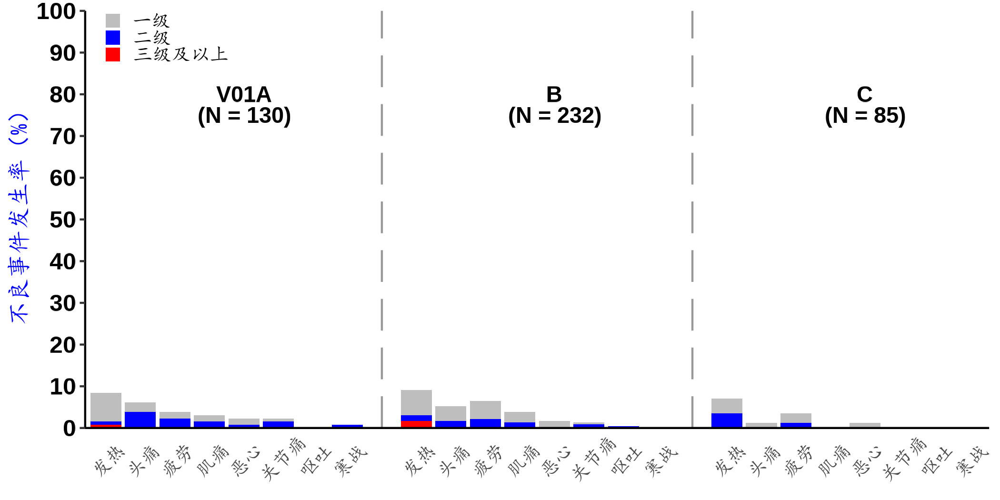
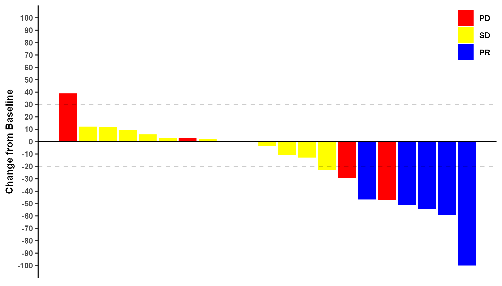

<!-- README.md is generated from README.Rmd. Please edit that file -->

```{r, include = FALSE}
knitr::opts_chunk$set(
  collapse = TRUE,
  comment = "#>",
  fig.path = "man/figures/README-",
  out.width = "100%"
)
```

# CPgraph

<!-- badges: start -->

<!-- badges: end -->

The goal of this package is to draw general clinical trials graphs.

"gmtplot" function is to draw GMT (Geometric Mean Titer) plot in immunogenicity in vaccine clinical trials. Please refer to [Generation of Geometric Mean Titer Plot in Immunogenicity from SAS and R](https://www.lexjansen.com/pharmasug-cn/2023/CC/Pharmasug-China-2023-CC115.pdf) from PharmaSUG.

"gmtplot_line" function is similar to "gmtplot" function. But if the analysis value is linear, "gmtplot_line" will be used; if the analysis value is exponential, "gmtplot" function will be used.

"aetoxgrplot" function is to draw adverse events toxicity grade plot in vaccine clinical trials.

"kmplot" function is to draw KM plot in oncology clinical trials.

"waterfallplot" function is to draw waterfallplot in oncology clinical trials.

## Installation

You can install the development version of CPgraph from [GitHub](https://github.com/) with:

``` r
# install.packages("devtools")
devtools::install_github("AQ-Life/CPgraph")
```

## Arguments

### gmtplot

| Function Name | Arguments   | Fucntion (Requirement)                                  | Default   |
|--------------|--------------|------------------------------|--------------|
| gmtplot       | datain      | 输入数据集（需包含USUBJID, TRTAN, AVISITN, AVAL, BASE） |           |
| gmtplot       | GrpVar      | 分组变量                                                | TRTAN     |
| gmtplot       | GrpLabel    | 分组变量展示的标签                                      |           |
| gmtplot       | AvisitnVar  | 分析访视变量（子分组变量）                              | AVISITN   |
| gmtplot       | AvisintVal  | 需要纳入的分析访视数值型结果                            |           |
| gmtplot       | AvisitLabel | 需要纳入的分析访视的标签                                |           |
| gmtplot       | Aval        | 分析值（数值型）                                        | AVAL      |
| gmtplot       | Base        | 基线值（数值型）                                        | BASE      |
| gmtplot       | YLabel      | Y轴标签                                                 |           |
| gmtplot       | LegendLabel | 分组变量的图例标签                                      |           |
| gmtplot       | colorSet    | 颜色设置（根据分组数量设置多个颜色）                    |           |
| gmtplot       | LineYN      | 是否绘制折线图                                          | FALSE     |
| gmtplot       | LegendYN    | 是否显示图例                                            | FALSE     |
| gmtplot       | FigureName  | 输出图片名称                                            | “gmtplot” |

### gmtplot_line

| Function Name | Arguments   | Fucntion (Requirement)                                  | Default   |
|--------------|--------------|------------------------------|--------------|
| gmtplot_line  | datain      | 输入数据集（需包含USUBJID, TRTAN, AVISITN, AVAL, BASE） |           |
| gmtplot_line  | GrpVar      | 分组变量                                                | TRTAN     |
| gmtplot_line  | GrpLabel    | 分组变量展示的标签                                      |           |
| gmtplot_line  | AvisitnVar  | 分析访视变量（子分组变量）                              | AVISITN   |
| gmtplot_line  | AvisintVal  | 需要纳入的分析访视数值型结果                            |           |
| gmtplot_line  | AvisitLabel | 需要纳入的分析访视的标签                                |           |
| gmtplot_line  | Aval        | 分析值（数值型）                                        | AVAL      |
| gmtplot_line  | Base        | 基线值（数值型）                                        | BASE      |
| gmtplot_line  | YLabel      | Y轴标签                                                 |           |
| gmtplot_line  | LegendLabel | 分组变量的图例标签                                      |           |
| gmtplot_line  | colorSet    | 颜色设置（根据分组数量设置多个颜色）                    |           |
| gmtplot_line  | LineYN      | 是否绘制折线图                                          | FALSE     |
| gmtplot_line  | LegendYN    | 是否显示图例                                            | FALSE     |
| gmtplot_line  | FigureName  | 输出图片名称                                            | “gmtplot” |

### aetoxgrplot

| Function Name | Arguments   | Fucntion (Requirement)                       | Default                         |
|----------------|----------------|--------------------------|----------------|
| aetoxgrplot   | dataADSL    | 输入分析人群的数据集（ADSL）                 |                                 |
| aetoxgrplot   | dataADAE    | 输入分析事件的数据集（ADAE）                 |                                 |
| aetoxgrplot   | GrpVar      | 分组变量                                     | TRTAN                           |
| aetoxgrplot   | GrpADSLVar  | 分析人群数据集的分组变量                     | TRT01AN                         |
| aetoxgrplot   | GrpLabel    | 分组变量展示的标签                           |                                 |
| aetoxgrplot   | ATOXGRNVar  | 分析访视变量（子分组变量）                   | ATOXGRN                         |
| aetoxgrplot   | AEDECODVar  | 需要纳入的分析访视数值型结果                 | AEDECOD                         |
| aetoxgrplot   | Ylabel      | Y轴标签                                      | c("不良事件发生率（%）")        |
| aetoxgrplot   | LegendLabel | 严重程度等级的标签                           | c("一级", "二级", "三级及以上") |
| aetoxgrplot   | colorSet    | 颜色设置（根据严重程度等级数量设置多个颜色） | c("grey", "blue", "red")        |
| aetoxgrplot   | FigureName  | 输出图片名称                                 | "aetoxgrplot"                   |

### kmplot

| Function Name | Arguments    | Fucntion (Requirement)               | Default  |
|---------------|---------------|---------------------------|---------------|
| kmplot        | datain       | 输入数据集（如ADTTE）                |          |
| kmplot        | GrpVar       | 分组变量                             | TRTAN    |
| kmplot        | GrpLabel     | 分组变量展示的标签                   |          |
| kmplot        | AVALVar      | 时间-事件分析的TIME                  | AVAL     |
| kmplot        | CNSRVar      | 时间-事件分析的CNSR                  | CNSR     |
| kmplot        | ByTime       | X轴递进的步长                        |          |
| kmplot        | XLabel       | X轴标签                              |          |
| kmplot        | YLabel       | Y轴标签                              |          |
| kmplot        | RiskLabel    | 风险表标签                           |          |
| kmplot        | colorSet     | 颜色设置（根据分组数量设置多个颜色） |          |
| kmplot        | ShowAreaYN   | 是否绘制置信区间的带状图             | FALSE    |
| kmplot        | LineMedianYN | 是否在中位生存概率绘制参考线         | FALSE    |
| kmplot        | PvalYN       | 是否添加log-rank P value             | FALSE    |
| kmplot        | FigureName   | 输出图片名称                         | “kmplot” |

### waterfallplot

| Function Name | Arguments    | Fucntion (Requirement)                   | Default                                     |
|----------------|----------------|------------------|----------------------|
| waterfallplot | datain       | 输入数据集                               |                                             |
| waterfallplot | BORVar       | BOR分组变量名                            |                                             |
| waterfallplot | CHGVar       | Y轴百分比变量名                          |                                             |
| waterfallplot | PercentLine1 | 百分比参考线1                            | FALSE                                       |
| waterfallplot | PercentLine2 | 百分比参考线2                            | FALSE                                       |
| waterfallplot | YLabel       | Y轴标签                                  |                                             |
| waterfallplot | colorSet     | 颜色设置（为CR,PR,SD,PR,NE分别设置颜色） | c("green", "blue", "yellow", "red", "grey") |
| waterfallplot | FigureName   | 输出图片名称                             | “waterfallplot”                             |

## Usage

This is a basic example which shows you how to solve a common problem.

### gmtplot

``` r
# {r example}
library(CPgraph)
library(haven)

adis <- read_sas("adis.sas7bdat")

adis <- adis %>% 
  dplyr::filter(IFASFL == "Y", PARAMCD == "SAR2NAB", ANL01FL == "Y", AVISITN %in% c(0,28,42)) %>% 
  mutate(Gvar = if_else(COHORT == "Cohort 2", TRTAN+2, TRTAN),
         AVISITN = if_else(AVISITN == 42, 28, AVISITN),
         AVISITN = if_else(AVISITN == 150, 120, AVISITN),
         AVISITN = if_else(AVISITN == 178, 148, AVISITN)) %>% 
  filter(Gvar %in% c(1,2,3))

gmtplot(datain = adis,
        GrpVar = adis$Gvar,
        GrpLabel = c("a", "Group B", "C"),
        AvisitnVar = adis$AVISITN,
        AvisintVal = c(0, 28),
        AvisitLabel = c("D0", "D28"),
        Aval = adis$AVAL,
        Base = adis$BASE,
        YLabel = "PRNT50LLL",
        LegendLabel = c("V01E","V01E-2"),
        colorSet = c("grey", "blue", "red"),
        LineYN = FALSE,
        LegendYN = FALSE,
        FigureName = "gmt_plot")
```


### gmtplot_line

``` r
# {r example}
library(CPgraph)
library(haven)

gmtplot_line(datain = adis2,
        GrpVar = adis2$GVAR,
        GrpLabel = c("<40 yrs", "40-49 yrs", ">=50 yrs"),
        AvisitnVar = adis2$AVISITN,
        AvisintVal = c(0, 30),
        AvisitLabel = c("D0", "D30"),
        Aval = adis2$AVAL,
        Base = adis2$BASE,
        YLabel = "PRNT50 Titer",
        LegendLabel = c(),
        colorSet = c("grey", "blue", "red"),
        LineYN = FALSE,
        LegendYN = FALSE,
        FigureName = x)
```


### aetoxgrplot

``` r
# {r example}
library(CPgraph)
library(haven)

adsl <- read_sas("adsl.sas7bdat") %>%
  filter(SAFFL == "是") %>%
  mutate(TRT01AN = if_else(AGE>=60,TRT01AN+2, TRT01AN))

adae <- read_sas("adae.sas7bdat") %>%
  filter(SAFFL == "是", AECAT == "征集性不良事件", AESCAT == "征集性全身不良事件", COHORTN == 1) %>% 
  mutate(TRTAN = if_else(AGE>=60, TRTAN+2, TRTAN))

aetoxgrplot(dataADSL = adsl,
            dataADAE = adae,
            GrpVar = adae$TRTAN,
            GrpADSLVar = adsl$TRT01AN,
            GrpLabel = c("V01A","B","C"),
            ATOXGRN = adae$ATOXGRN,
            AEDECOD = adae$AEDECOD,
            Ylabel = c("不良事件发生率（%）"),
            LegendLabel = c("一级", "二级", "三级及以上"),
            colorSet = c("grey", "blue", "red"),
            FigureName = "aetox")
```



### kmplot

``` r
library(CPgraph)
library(haven)

adtte <- read_sas("adtte.sas7bdat") %>%
  filter(FASFL=='Y', ADAPT=='结直肠癌', PARAMCD=='OS') %>%
  mutate(COHORTN = case_when(COHORT=="队列2" ~ 1,
                             COHORT=="队列3-A" ~ 2,
                             COHORT=="队列3-B" ~ 3))

kmplot(datain = adtte,
       GrpVar = adtte$COHORTN,
       GrpLabel = c("Group A", "B","C"),
       AVALVar = adtte$AVAL,
       CNSRVar = adtte$CNSR,
       ByTime = 2,
       XLabel = "XXXX",
       YLabel = "YYYY",
       RiskLabel = "Number at risk",
       colorSet = c("grey", "blue", "red"),
       ShowAreaYN = TRUE,
       LineMedianYN = TRUE,
       PvalYN = TRUE,
       FigureName = "kmplot")
```


### waterfallplot

``` r
library(CPgraph)
library(haven)

water <- read_sas("waterfalldata.sas7bdat")

head(water)

waterfallplot(water,
              BORVar = water$bor,
              CHGVar = water$chgx,
              PercentLine1 = 30,
              PercentLine2 = -20,
              YLabel = "Change from Baseline",
              colorSet = c("green", "blue", "yellow", "red", "grey"),
              FigureName = "waterfallplot")
```



## Additional Requirements

The dataset imported from .sas7bdat needs to generated per ADaM IG and includes main variables that will be used.
