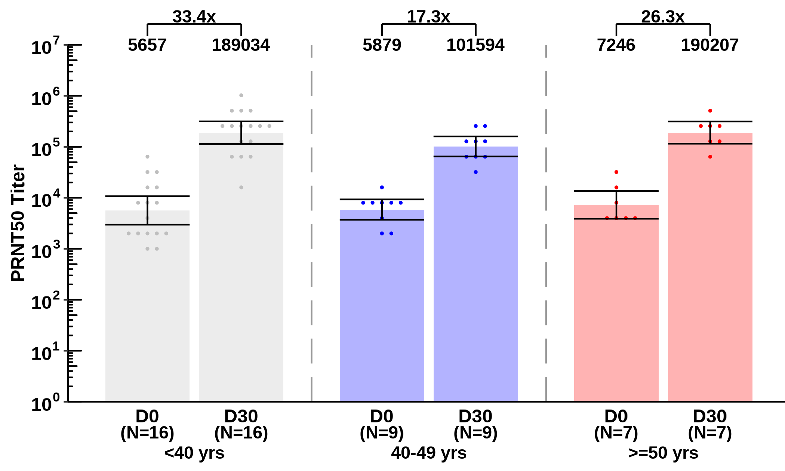
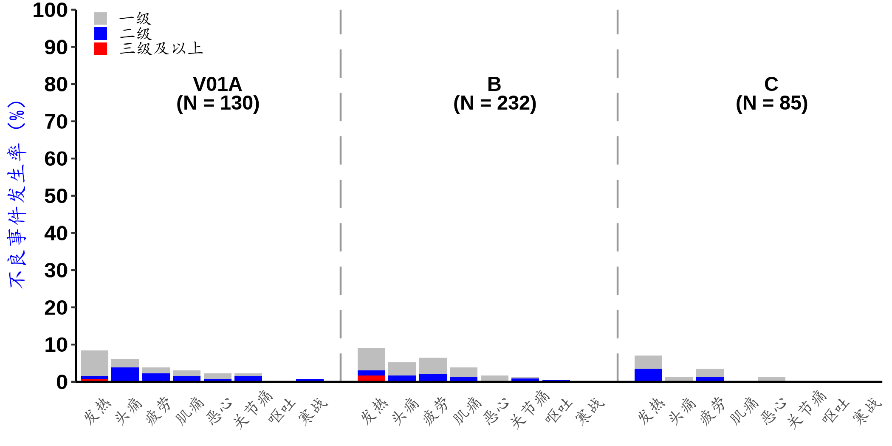
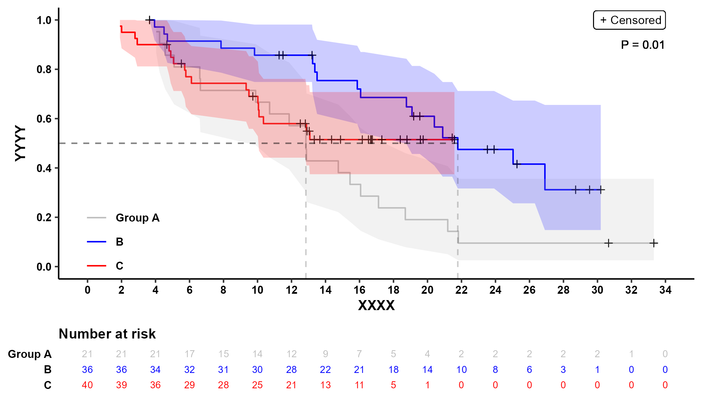
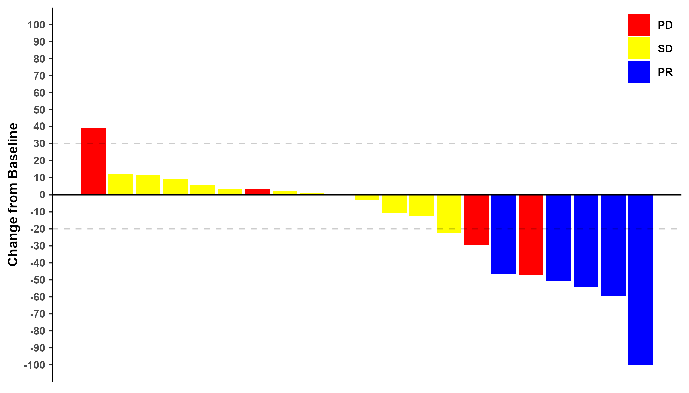
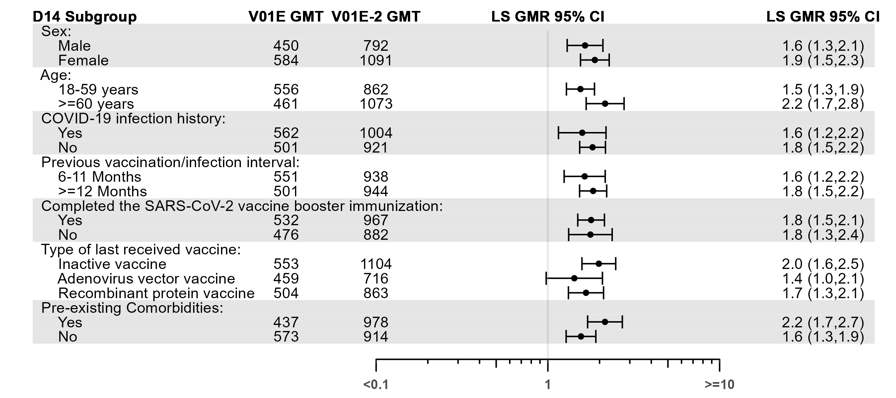
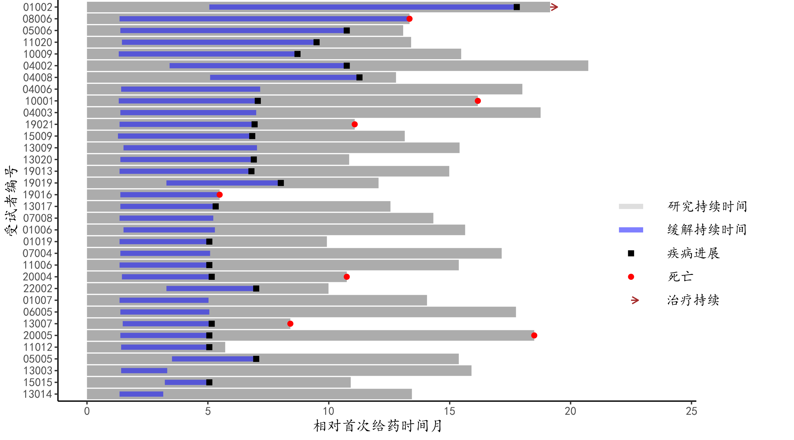

<!-- README.md is generated from README.Rmd. Please edit that file -->

# CPgraph

<!-- badges: start -->
<!-- badges: end -->

The goal of this package is to draw general clinical trials graphs.

“gmtplot” function is to draw GMT (Geometric Mean Titer) plot in
immunogenicity in vaccine clinical trials. Please refer to [Generation
of Geometric Mean Titer Plot in Immunogenicity from SAS and
R](https://www.lexjansen.com/pharmasug-cn/2023/CC/Pharmasug-China-2023-CC115.pdf)
from PharmaSUG.

“gmtplot_line” function is similar to “gmtplot” function. But if the
analysis value is linear, “gmtplot_line” will be used; if the analysis
value is exponential, “gmtplot” function will be used.

“aetoxgrplot” function is to draw adverse events toxicity grade plot in
vaccine clinical trials.

“kmplot” function is to draw KM plot in oncology clinical trials.

“waterfallplot” function is to draw waterfallplot in oncology clinical
trials.

“forsetplot” function is to draw forestplot in oncology clinical trials.

“swimmerplot” function is to draw swimmerplot in oncology clinical
trials.

## Installation

You can install the development version of CPgraph from
[GitHub](https://github.com/) with:

``` r
# install.packages("devtools")
devtools::install_github("AQ-Life/CPgraph")
```

## Arguments

### gmtplot

| Function Name | Arguments   | Fucntion (Requirement)                                  | Default   |
|---------------|-------------|---------------------------------------------------------|-----------|
| gmtplot       | datain      | 输入数据集（需包含USUBJID, TRTAN, AVISITN, AVAL, BASE） |           |
| gmtplot       | GrpVar      | 分组变量                                                | TRTAN     |
| gmtplot       | GrpLabel    | 分组变量展示的标签                                      |           |
| gmtplot       | AvisitnVar  | 分析访视变量（子分组变量）                              | AVISITN   |
| gmtplot       | AvisintVal  | 需要纳入的分析访视数值型结果                            |           |
| gmtplot       | AvisitLabel | 需要纳入的分析访视的标签                                |           |
| gmtplot       | Aval        | 分析值（数值型）                                        | AVAL      |
| gmtplot       | Base        | 基线值（数值型）                                        | BASE      |
| gmtplot       | YLabel      | Y轴标签                                                 |           |
| gmtplot       | LegendLabel | 分组变量的图例标签                                      |           |
| gmtplot       | colorSet    | 颜色设置（根据分组数量设置多个颜色）                    |           |
| gmtplot       | LineYN      | 是否绘制折线图                                          | FALSE     |
| gmtplot       | LegendYN    | 是否显示图例                                            | FALSE     |
| gmtplot       | FigureName  | 输出图片名称                                            | “gmtplot” |

### gmtplot_line

| Function Name | Arguments   | Fucntion (Requirement)                                  | Default   |
|---------------|-------------|---------------------------------------------------------|-----------|
| gmtplot_line  | datain      | 输入数据集（需包含USUBJID, TRTAN, AVISITN, AVAL, BASE） |           |
| gmtplot_line  | GrpVar      | 分组变量                                                | TRTAN     |
| gmtplot_line  | GrpLabel    | 分组变量展示的标签                                      |           |
| gmtplot_line  | AvisitnVar  | 分析访视变量（子分组变量）                              | AVISITN   |
| gmtplot_line  | AvisintVal  | 需要纳入的分析访视数值型结果                            |           |
| gmtplot_line  | AvisitLabel | 需要纳入的分析访视的标签                                |           |
| gmtplot_line  | Aval        | 分析值（数值型）                                        | AVAL      |
| gmtplot_line  | Base        | 基线值（数值型）                                        | BASE      |
| gmtplot_line  | YLabel      | Y轴标签                                                 |           |
| gmtplot_line  | LegendLabel | 分组变量的图例标签                                      |           |
| gmtplot_line  | colorSet    | 颜色设置（根据分组数量设置多个颜色）                    |           |
| gmtplot_line  | LineYN      | 是否绘制折线图                                          | FALSE     |
| gmtplot_line  | LegendYN    | 是否显示图例                                            | FALSE     |
| gmtplot_line  | FigureName  | 输出图片名称                                            | “gmtplot” |

### aetoxgrplot

| Function Name | Arguments   | Fucntion (Requirement)                       | Default                         |
|---------------|-------------|----------------------------------------------|---------------------------------|
| aetoxgrplot   | dataADSL    | 输入分析人群的数据集（ADSL）                 |                                 |
| aetoxgrplot   | dataADAE    | 输入分析事件的数据集（ADAE）                 |                                 |
| aetoxgrplot   | GrpVar      | 分组变量                                     | TRTAN                           |
| aetoxgrplot   | GrpADSLVar  | 分析人群数据集的分组变量                     | TRT01AN                         |
| aetoxgrplot   | GrpLabel    | 分组变量展示的标签                           |                                 |
| aetoxgrplot   | ATOXGRNVar  | 分析访视变量（子分组变量）                   | ATOXGRN                         |
| aetoxgrplot   | AEDECODVar  | 需要纳入的分析访视数值型结果                 | AEDECOD                         |
| aetoxgrplot   | Ylabel      | Y轴标签                                      | c(“不良事件发生率（%）”)        |
| aetoxgrplot   | LegendLabel | 严重程度等级的标签                           | c(“一级”, “二级”, “三级及以上”) |
| aetoxgrplot   | colorSet    | 颜色设置（根据严重程度等级数量设置多个颜色） | c(“grey”, “blue”, “red”)        |
| aetoxgrplot   | FigureName  | 输出图片名称                                 | “aetoxgrplot”                   |

### kmplot

| Function Name | Arguments    | Fucntion (Requirement)               | Default  |
|---------------|--------------|--------------------------------------|----------|
| kmplot        | datain       | 输入数据集（如ADTTE）                |          |
| kmplot        | GrpVar       | 分组变量                             | TRTAN    |
| kmplot        | GrpLabel     | 分组变量展示的标签                   |          |
| kmplot        | AVALVar      | 时间-事件分析的TIME                  | AVAL     |
| kmplot        | CNSRVar      | 时间-事件分析的CNSR                  | CNSR     |
| kmplot        | ByTime       | X轴递进的步长                        |          |
| kmplot        | XLabel       | X轴标签                              |          |
| kmplot        | YLabel       | Y轴标签                              |          |
| kmplot        | RiskLabel    | 风险表标签                           |          |
| kmplot        | colorSet     | 颜色设置（根据分组数量设置多个颜色） |          |
| kmplot        | ShowAreaYN   | 是否绘制置信区间的带状图             | FALSE    |
| kmplot        | LineMedianYN | 是否在中位生存概率绘制参考线         | FALSE    |
| kmplot        | PvalYN       | 是否添加log-rank P value             | FALSE    |
| kmplot        | FigureName   | 输出图片名称                         | “kmplot” |

### waterfallplot

| Function Name | Arguments    | Fucntion (Requirement)                   | Default                                     |
|---------------|--------------|------------------------------------------|---------------------------------------------|
| waterfallplot | datain       | 输入数据集                               |                                             |
| waterfallplot | BORVar       | BOR分组变量名                            |                                             |
| waterfallplot | CHGVar       | Y轴百分比变量名                          |                                             |
| waterfallplot | PercentLine1 | 百分比参考线1                            | FALSE                                       |
| waterfallplot | PercentLine2 | 百分比参考线2                            | FALSE                                       |
| waterfallplot | YLabel       | Y轴标签                                  |                                             |
| waterfallplot | colorSet     | 颜色设置（为CR,PR,SD,PR,NE分别设置颜色） | c(“green”, “blue”, “yellow”, “red”, “grey”) |
| waterfallplot | FigureName   | 输出图片名称                             | “waterfallplot”                             |

### forestplot

| Function Name | Arguments     | Fucntion (Requirement)               | Default      |
|---------------|---------------|--------------------------------------|--------------|
| forestplot    | datain        | 输入数据集                           |              |
| forestplot    | XVar          | 绘制散点图的X轴变量                  |              |
| forestplot    | XLowVar       | 置信区间下限                         |              |
| forestplot    | XUppVar       | 置信区间上限                         |              |
| forestplot    | YOrderVar     | Y轴的数值型变量（从1，2，3…)         |              |
| forestplot    | XLine         | X轴上的参考线的数值型值              |              |
| forestplot    | YRefVar       | 绘制背景色块的Y值（来源于YOrderVar） |              |
| forestplot    | YRefWidth     | 背景色块的高度                       |              |
| forestplot    | Anno1Var      | 第1列注释的变量                      |              |
| forestplot    | Anno1VarX     | 第1列注释变量在X轴的坐标             |              |
| forestplot    | Anno1VarLabel | 第1列注释变量的Label                 |              |
| forestplot    | Anno2Var      | 第2列注释的变量                      |              |
| forestplot    | Anno2VarX     | 第2列注释变量在X轴的坐标             |              |
| forestplot    | Anno2VarLabel | 第2列注释变量的Label                 |              |
| forestplot    | Anno3Var      | 第3列注释的变量                      |              |
| forestplot    | Anno3VarX     | 第3列注释变量在X轴的坐标             |              |
| forestplot    | Anno3VarLabel | 第3列注释变量的Label                 |              |
| forestplot    | Anno4Var      | 第4列注释的变量                      |              |
| forestplot    | Anno4VarX     | 第4列注释变量在X轴的坐标             |              |
| forestplot    | Anno4VarLabel | 第4列注释变量的Label                 |              |
| forestplot    | Anno5Var      | 第5列注释的变量                      |              |
| forestplot    | Anno5VarX     | 第5列注释变量在X轴的坐标             |              |
| forestplot    | Anno5VarLabel | 第5列注释变量的Label                 |              |
| forestplot    | Anno6Var      | 第6列注释的变量                      |              |
| forestplot    | Anno6VarX     | 第6列注释变量在X轴的坐标             |              |
| forestplot    | Anno6VarLabel | 第6列注释变量的Label                 |              |
| forestplot    | AnnoLineLabel | XLine参数的Label                     |              |
| forestplot    | XaxisValue    | X轴上需要展示X的值                   |              |
| forestplot    | XaxisLabel    | X轴上展示的X值的Label                |              |
| forestplot    | XaxisType     | X轴的类型（“line”, “log”）           |              |
| forestplot    | leftmargin    | 图形左侧预留的空间                   |              |
| forestplot    | rightmargin   | 图形右侧预留的空间                   |              |
| forestplot    | figwidth      | 输出图片宽度                         |              |
| forestplot    | figheight     | 输出图片高度                         |              |
| forestplot    | FigureName    | 输出图片名称                         | “forestplot” |

### swimmerplot

| Function Name | Arguments      | Fucntion (Requirement)      | Default   |
|---------------|----------------|-----------------------------|-----------|
| swimmerplot   | datain         | 输入数据集                  |           |
| swimmerplot   | YaxisVar       | Y轴变量（离散型）           |           |
| swimmerplot   | BarVar         | 绘制条形图的变量            |           |
| swimmerplot   | BarColor       | 条形图的颜色                |           |
| swimmerplot   | BarWidth       | 条形图的宽度                |           |
| swimmerplot   | BarLabel       | 条形图的label               |           |
| swimmerplot   | BarLabelY      | 条形图label在Y轴的位置      |           |
| swimmerplot   | Line1VarMin    | 第1个线图在X轴的起点        |           |
| swimmerplot   | Line1VarMax    | 第1个线图在X轴的终点        |           |
| swimmerplot   | Line1color     | 第1个线图的颜色             |           |
| swimmerplot   | Line1Width     | 第1个线图的宽度             |           |
| swimmerplot   | Line1Label     | 第1个线图的label            |           |
| swimmerplot   | Line1LabelY    | 第1个线图的label在Y轴的位置 |           |
| swimmerplot   | Line2VarMin    | 第2个线图在X轴的起点        |           |
| swimmerplot   | Line2VarMax    | 第2个线图在X轴的终点        |           |
| swimmerplot   | Line2color     | 第2个线图的颜色             |           |
| swimmerplot   | Line2Width     | 第2个线图的宽度             |           |
| swimmerplot   | Line2Label     | 第2个线图的label            |           |
| swimmerplot   | Line2LabelY    | 第2个线图的label在Y轴的位置 |           |
| swimmerplot   | Line3VarMin    | 第3个线图在X轴的起点        |           |
| swimmerplot   | Line3VarMax    | 第3个线图在X轴的终点        |           |
| swimmerplot   | Line3color     | 第3个线图的颜色             |           |
| swimmerplot   | Line3Width     | 第3个线图的宽度             |           |
| swimmerplot   | Line3Label     | 第3个线图的label            |           |
| swimmerplot   | Line3LabelY    | 第3个线图的label在Y轴的位置 |           |
| swimmerplot   | Point1Var      | 第1个点图的变量             |           |
| swimmerplot   | Point1Color    | 第1个点图的颜色             |           |
| swimmerplot   | Point1Shape    | 第1个点图的形状             |           |
| swimmerplot   | Point1Label    | 第1个点图的label            |           |
| swimmerplot   | Point1LabelY   | 第1个点图的label在Y轴的位置 |           |
| swimmerplot   | Point2Var      | 第2个点图的变量             |           |
| swimmerplot   | Point2Color    | 第2个点图的颜色             |           |
| swimmerplot   | Point2Shape    | 第2个点图的形状             |           |
| swimmerplot   | Point2Label    | 第2个点图的label            |           |
| swimmerplot   | Point2LabelY   | 第2个点图的label在Y轴的位置 |           |
| swimmerplot   | Point3Var      | 第3个点图的变量             |           |
| swimmerplot   | Point3Color    | 第3个点图的颜色             |           |
| swimmerplot   | Point3Shape    | 第3个点图的形状             |           |
| swimmerplot   | Point3Label    | 第3个点图的label            |           |
| swimmerplot   | Point3LabelY   | 第3个点图的label在Y轴的位置 |           |
| swimmerplot   | Point4Var      | 第4个点图的变量             |           |
| swimmerplot   | Point4Color    | 第4个点图的颜色             |           |
| swimmerplot   | Point4Shape    | 第4个点图的形状             |           |
| swimmerplot   | Point4Label    | 第4个点图的label            |           |
| swimmerplot   | Point4LabelY   | 第4个点图的label在Y轴的位置 |           |
| swimmerplot   | Point5Var      | 第5个点图的变量             |           |
| swimmerplot   | Point5Color    | 第5个点图的颜色             |           |
| swimmerplot   | Point5Shape    | 第5个点图的形状             |           |
| swimmerplot   | Point5Label    | 第5个点图的label            |           |
| swimmerplot   | Point5LabelY   | 第5个点图的label在Y轴的位置 |           |
| swimmerplot   | Point6Var      | 第6个点图的变量             |           |
| swimmerplot   | Point6Color    | 第6个点图的颜色             |           |
| swimmerplot   | Point6Shape    | 第6个点图的形状             |           |
| swimmerplot   | Point6Label    | 第6个点图的label            |           |
| swimmerplot   | Point6LabelY   | 第6个点图的label在Y轴的位置 |           |
| swimmerplot   | Point7Var      | 第7个点图的变量             |           |
| swimmerplot   | Point7Color    | 第7个点图的颜色             |           |
| swimmerplot   | Point7Shape    | 第7个点图的形状             |           |
| swimmerplot   | Point7Label    | 第7个点图的label            |           |
| swimmerplot   | Point7LabelY   | 第7个点图的label在Y轴的位置 |           |
| swimmerplot   | Point8Var      | 第8个点图的变量             |           |
| swimmerplot   | Point8Color    | 第8个点图的颜色             |           |
| swimmerplot   | Point8Shape    | 第8个点图的形状             |           |
| swimmerplot   | Point8Label    | 第8个点图的label            |           |
| swimmerplot   | Point8LabelY   | 第8个点图的label在Y轴的位置 |           |
| swimmerplot   | Segment1Var    | 第1个箭头的变量             |           |
| swimmerplot   | Segment1Color  | 第1个箭头的颜色             |           |
| swimmerplot   | Segment1Label  | 第1个箭头的label            |           |
| swimmerplot   | Segment1LabelY | 第1个箭头的label在Y轴的位置 |           |
| swimmerplot   | XaxisLabel     | X轴label                    |           |
| swimmerplot   | YaxisLabel     | Y轴label                    |           |
| swimmerplot   | figwidth       | 图片的宽度                  |           |
| swimmerplot   | figheight      | 图片的高度                  |           |
| swimmerplot   | FigureName     | 输出图片名称                | “gmtplot” |

## Usage

This is a basic example which shows you how to solve a common problem.

### gmtplot

``` r
# {r example}
library(CPgraph)
library(haven)

adis <- read_sas("adis.sas7bdat")

adis <- adis %>% 
  dplyr::filter(IFASFL == "Y", PARAMCD == "SAR2NAB", ANL01FL == "Y", AVISITN %in% c(0,28,42)) %>% 
  mutate(Gvar = if_else(COHORT == "Cohort 2", TRTAN+2, TRTAN),
         AVISITN = if_else(AVISITN == 42, 28, AVISITN),
         AVISITN = if_else(AVISITN == 150, 120, AVISITN),
         AVISITN = if_else(AVISITN == 178, 148, AVISITN)) %>% 
  filter(Gvar %in% c(1,2,3))

gmtplot(datain = adis,
        GrpVar = adis$Gvar,
        GrpLabel = c("a", "Group B", "C"),
        AvisitnVar = adis$AVISITN,
        AvisintVal = c(0, 28),
        AvisitLabel = c("D0", "D28"),
        Aval = adis$AVAL,
        Base = adis$BASE,
        YLabel = "PRNT50LLL",
        LegendLabel = c("V01E","V01E-2"),
        colorSet = c("grey", "blue", "red"),
        LineYN = FALSE,
        LegendYN = FALSE,
        FigureName = "gmt_plot")
```



### gmtplot_line

``` r
# {r example}
library(CPgraph)
library(haven)

gmtplot_line(datain = adis2,
        GrpVar = adis2$GVAR,
        GrpLabel = c("<40 yrs", "40-49 yrs", ">=50 yrs"),
        AvisitnVar = adis2$AVISITN,
        AvisintVal = c(0, 30),
        AvisitLabel = c("D0", "D30"),
        Aval = adis2$AVAL,
        Base = adis2$BASE,
        YLabel = "PRNT50 Titer",
        LegendLabel = c(),
        colorSet = c("grey", "blue", "red"),
        LineYN = FALSE,
        LegendYN = FALSE,
        FigureName = x)
```


### aetoxgrplot

``` r
# {r example}
library(CPgraph)
library(haven)

adsl <- read_sas("adsl.sas7bdat") %>%
  filter(SAFFL == "是") %>%
  mutate(TRT01AN = if_else(AGE>=60,TRT01AN+2, TRT01AN))

adae <- read_sas("adae.sas7bdat") %>%
  filter(SAFFL == "是", AECAT == "征集性不良事件", AESCAT == "征集性全身不良事件", COHORTN == 1) %>% 
  mutate(TRTAN = if_else(AGE>=60, TRTAN+2, TRTAN))

aetoxgrplot(dataADSL = adsl,
            dataADAE = adae,
            GrpVar = adae$TRTAN,
            GrpADSLVar = adsl$TRT01AN,
            GrpLabel = c("V01A","B","C"),
            ATOXGRN = adae$ATOXGRN,
            AEDECOD = adae$AEDECOD,
            Ylabel = c("不良事件发生率（%）"),
            LegendLabel = c("一级", "二级", "三级及以上"),
            colorSet = c("grey", "blue", "red"),
            FigureName = "aetox")
```



### kmplot

``` r
library(CPgraph)
library(haven)

adtte <- read_sas("adtte.sas7bdat") %>%
  filter(FASFL=='Y', ADAPT=='结直肠癌', PARAMCD=='OS') %>%
  mutate(COHORTN = case_when(COHORT=="队列2" ~ 1,
                             COHORT=="队列3-A" ~ 2,
                             COHORT=="队列3-B" ~ 3))

kmplot(datain = adtte,
       GrpVar = adtte$COHORTN,
       GrpLabel = c("Group A", "B","C"),
       AVALVar = adtte$AVAL,
       CNSRVar = adtte$CNSR,
       ByTime = 2,
       XLabel = "XXXX",
       YLabel = "YYYY",
       RiskLabel = "Number at risk",
       colorSet = c("grey", "blue", "red"),
       ShowAreaYN = TRUE,
       LineMedianYN = TRUE,
       PvalYN = TRUE,
       FigureName = "kmplot")
```



### waterfallplot

``` r
library(CPgraph)
library(haven)

water <- read_sas("waterfalldata.sas7bdat")

head(water)

waterfallplot(water,
              BORVar = water$bor,
              CHGVar = water$chgx,
              PercentLine1 = 30,
              PercentLine2 = -20,
              YLabel = "Change from Baseline",
              colorSet = c("green", "blue", "yellow", "red", "grey"),
              FigureName = "waterfallplot")
```



### forestplot

``` r
forestdata <- read_sas("forestdata.sas7bdat")

final <- forestdata %>%
  mutate(ref = if_else(yord %in% c(4,5,6,10,11,12,16,17,18,19), NA, yord))

forestplot(
  datain = final,
  XVar = final$means,
  XLowVar = final$yerrl,
  XUppVar = final$yerru,
  YOrderVar = final$yord,
  XLine = 1,
  YRefVar = final$ref,
  YRefWidth = 4.9,
  Anno1Var = final$col1,
  Anno1VarX = 10^-3,
  Anno1VarLabel = "D14 Subgroup",
  Anno2Var = final$col2,
  Anno2VarX = 3*10^-2,
  Anno2VarLabel = "V01E GMT",
  Anno3Var = final$col3,
  Anno3VarX = 10^-1,
  Anno3VarLabel = "V01E-2 GMT",
  Anno4Var = final$col5,
  Anno4VarX = 4*10^1,
  Anno4VarLabel = "LS GMR 95% CI",
  Anno5Var = NULL,
  Anno5VarX = NULL,
  Anno5VarLabel = NULL,
  Anno6Var = NULL,
  Anno6VarX = NULL,
  Anno6VarLabel = NULL,
  AnnoLineLabel = "LS GMR 95% CI",
  XaxisValue = c(0.1, 1, 10),
  XaxisLabel = c("<0.1", "1", ">=10"),
  XaxisType = "log",
  leftmargin = 9.5,
  rightmargin = 4.5,
  figwidth = 9,
  figheight = 4,
  FigureName = "forestplot"
)
```



### swimmerplot

``` r
library(readxl)

swimmerdata <- read_excel("f_14_4_2_1_swimmer.xlsx",
                          sheet="f_14_4_2_1_swimmer",
                          col_names = TRUE)

swimmerplot(datain = swimmerdata,
            YaxisVar = swimmerdata$SUBJID,
            BarVar = swimmerdata$trtedy,
            BarColor = "grey",
            BarWidth = 0.01,
            BarLabel = "研究持续时间",
            BarLabelY = 17,
            Line1VarMin = swimmerdata$startdr,
            Line1VarMax = swimmerdata$enddy,
            Line1color = "blue",
            Line1Width = 2,
            Line1Label = "缓解持续时间",
            Line1LabelY = 15,
            Point1Var = swimmerdata$pddy,
            Point1Color = "black",
            Point1Shape = 15,
            Point1Label = "疾病进展",
            Point1LabelY = 13,
            Point2Var = swimmerdata$dthdy,
            Point2Color = "red",
            Point2Shape = 16,
            Point2Label = "死亡",
            Point2LabelY = 11,
            Segment1Var = swimmerdata$exongo,
            Segment1Color = "brown",
            Segment1Label = "治疗持续",
            Segment1LabelY = 9,
            XaxisLabel = "相对首次给药时间月",
            YaxisLabel = "受试者编号",
            figwidth = 9,
            figheight = 5,
            FigureName = "swimmerplot")
```



## Additional Requirements

The dataset imported from .sas7bdat needs to generated per ADaM IG and
includes main variables that will be used.
